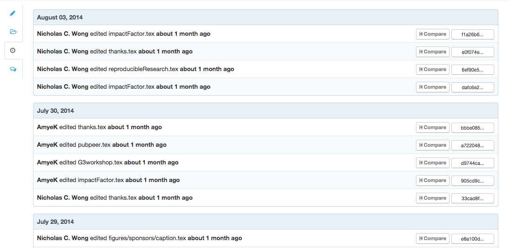
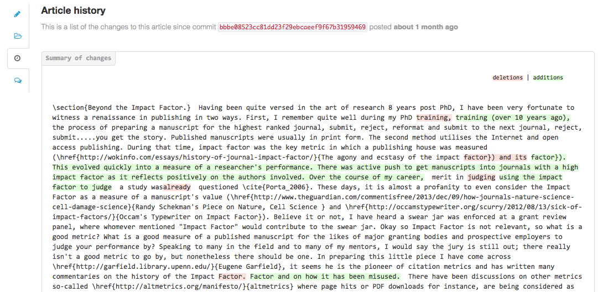

### Drafting a manuscript in LaTeX.

The text in an Authorea document is written in a markup language known as [LaTeX](http://www.latex-project.org/). 
LaTeX is great for writing research articles (particularly those with mathematical equations) but it was made
with the printed page in mind (see [here](https://authorea.com/users/3/articles/4675/_show_article) for a detailed 
discussion) and can be quite difficult to learn. 

Fortunately, LaTeX is *much* easier to use on Authorea. The creators have produced a 
[short cheatsheet](https://authorea.com/users/3/articles/6868/_show_article) on web-friendly LaTeX 
(i.e. a list of LaTeX commands that work on the web), and that's all you really need to get started!

##### Text blocks

The manuscript can be divided up into blocks and each can be individually edited. Between each block, one could
add a figure (more in inserting figures [here](../06_Figures/insertingFigures.md)). One could think of blocks as
a chapter or a section in a manuscript.

Double clicking on a chunk invokes the text editor. 

You can give each block a unique name. 

##### Buttons

There are a number of buttons on the top of the editor as well as ones along the bottom, these will be explaned from left to right. 

* The buttons found on the top right of the editor are essentially shortcuts to LaTeX code for basic formatting functions. 
* The `+` button is the insert citation function. This will be covered more the section on [adding citations](../07_Citations).
* The **B** button is to insert bold type into the editor. Clicking on this automatically inserts LaTex code for bold type into the editor, `/textbf{}`.
* The ***i*** button is to insert italic type into the editor, like for bold type above, clicking this button insert `/textit{}` into the editor.
* The next button `{}` is used to insert code snippets into your manuscript. 
* The following two are for inserting lists into your block. These can be bullet points or numbered lists. Clicking on either of these buttons will insert the associated LaTeX code into the text box.
* The following buttons are used to insert a block quote code **"**, insert link and finally insert heading stye. 
* The right hand most drop down menu on the top right of the editor allows you to select encoding, whether it be markdown (suffixed with `.md`) or LaTeX (which we are convering today).

##### Challenge 1 

Create a new block, give the block a name, insert bold type text and italic type text into the editor. Click on 
preview to see what happens. How would you make text both bold AND italic? (Hint: requires coding). Check to see you have done
this by previewing or saving and closing the text editor. 

More challenging tasks to follow including:
* [Writing equations and tables](../05_EquationsTables/insertingEquations.md)
* [Inserting figures and cross referencing](../06_Figures/insertingFigures.md)
* [Citations](../07_Citations/insertingCitations)

##### Tabs

<<<<<<< HEAD

=======
So far we've been working in the main tab. The other tabs on the left hand side of the document link to the guts of the Authorea document (Folder and History) and provide a space for authors to communicate (Chat). 
>>>>>>> FETCH_HEAD

The History tab is particularly interesting, as it links to a record of the editing of the manuscript by yourself and your 
collaborators. Here, you can easily track changes and by which contributor working on the manusctipt(s). By simply clicking on 
the compare button on the right hand side, it's easy to visualise the changes that have happened and made by whom. More information can be found [here](../08_collaborativeEditing/collaborating.md). 

<<<<<<< HEAD

More information can be found [here](../08_collaborativeEditing/collaborating.md). 
=======
>>>>>>> FETCH_HEAD

##### Challenge 2 

Edit a block within your document, preferably one that is shared with your neighbour. Click save and close then go into 
the history tab to ovserve the changes made on the document. 

----  
Next, we will learn about [writing equations and tables](../05_EquationsTables/insertingEquations.md). 

